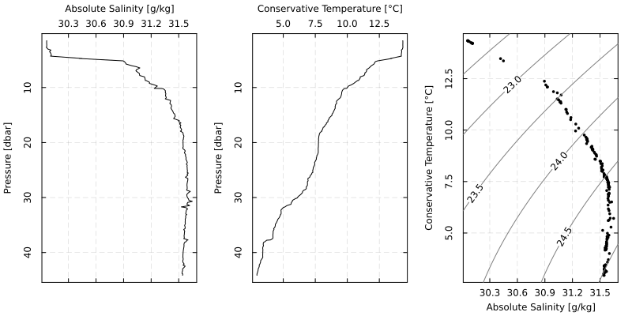
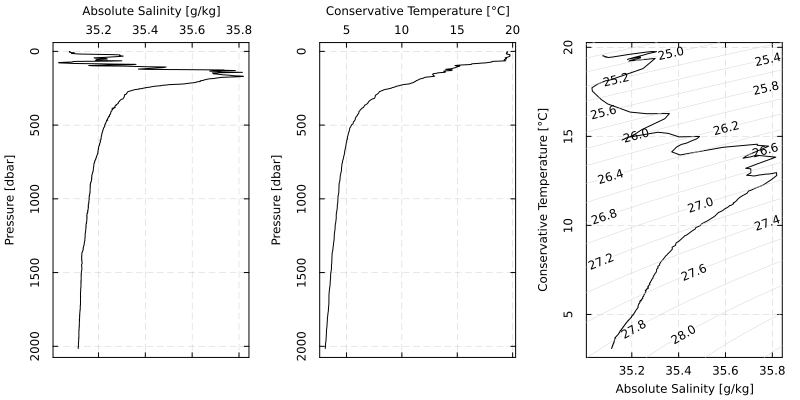

# OceanAnalysis.jl

OceanAnalysis.jl is a Julia package designed to facilitate the analysis of
oceanographic data. It is at an early stage of development by someone who is in
the early stages of exploring Julia as a supplement to R. The intention is to
add/refine features based on tasks that come up in the author's everyday work.

## Installation

### Official version

Once (if) the package is accepted by the Julia archive system, you may install
it by typing the following in a Julia console.

```julia
using Pkg ; Pkg.add("OceanAnalysis")
```

(This version will lag quite far behind the development version.)

### Development version

#### Somewhat stable (for early users)

Type the following in a Julia console to use the "main" branch from the
development website. This is updated after significant changes to the "develop"
branch (that have passed the built-in test suite).

```julia
using Pkg ; Pkg.add(url="https://github.com/dankelley/OceanAnalysis.jl")
```

#### Unstable (for developers)

Type the following in a Julia console to use the "develop" branch from the
development website.  This is updated very frequently, because the author tests
changes using this method.

```julia
using Pkg ; Pkg.add(url="https://github.com/dankelley/OceanAnalysis.jl", rev="develop")
```

#### Brittle (for the core developer)

In the commandline, navigate to the local source for the library.  Then start
a Julia console and type the following.

```julia
]
develop .
```

This sets Julia to look for changes in the files in that directory. Thereafter,
or at least until another `Pkg.add(url)` command is invoked, issuing `using
OceanAnalysis` in a Julia session will rebuild from that local source.

## Usage Examples

### CTD file

```julia
# Read a built-in CTD file, and plot some hydrographic diagrams
using OceanAnalysis, Plots, Measures
filename = joinpath(dirname(dirname(pathof(OceanAnalysis))), "data",
    "ctd.cnv")
ctd = read_ctd_cnv(filename)
p1 = plot_profile(ctd, "SA")
p2 = plot_profile(ctd, "CT")
p3 = plot_TS(ctd)
plot(p1, p2, p3, layout=(1, 3), size=(800, 400), margin=0.25cm)
```



### Argo file

```julia
# Read a built-in Argo file, and plot some hydrographic diagrams
using OceanAnalysis, Plots, Measures
filename = joinpath(dirname(dirname(pathof(OceanAnalysis))), "data",
    "D4902911_095.nc")
ctd = read_argo(filename)
p1 = plot_profile(ctd, "SA")
p2 = plot_profile(ctd, "CT")
p3 = plot_TS(ctd)
plot(p1, p2, p3, layout=(1, 3), size=(800, 400), margin=0.25cm)
```



## History of changes

### 0.1.0

This version is in use by the author, and may also be suitable for other users
who are comfortable with the possibility of changes to function names and
arguments.

#### Breaking changes

* Switch to snake-case for function names and argument names. For example, the
  name of `plotTS()` was changed to `plot_TS()`, and its argument
`drawFreezing` was changed to `draw_freezing`.  The point of this is to fit
what seems to be the Julia convention, which has the benefit of reinforcing to
the user that this is distinct from the oce R package, which uses the
camel-case notation.

#### Non-breaking changes

* Add `pretty()`, for use in contouring (especially for `plot_TS()`).
* Add `depth_from_pressure()`, `z_from_pressure()`, `pressure_from_depth()`,
  and `pressure_from_z()`.
* Change the second digit of version string to indicate that the package is becoming
  suitable for at least exploratory testing on real data.

### 0.0.3

#### Breaking changes

There are no breaking changes; all change are additions or bug fixes.

#### Non-breaking changes

* Add built-in data file `ctd.cnv.nc`, and use it in an example in the `Ctd()` documentation.
* Add built-in data file `D4902911_095.nc`, and use it in an example in the `plot_profile()` documentation.
* `get_element()` can now return `"N2"`.
* `plot_profile()` can now plot `N2"`.

### 0.0.2

#### Breaking changes

There are no breaking changes; all change are additions or bug fixes.

#### Non-breaking changes

* Add `N2()` to compute the square of the buoyancy frequency.

## Developer notes

### Adding a package dependency

For example, to add `Downloads` as a dependency to the present package,
navigate to the present-package source directory, start a Julia session, and
type the following.

```julia
]
activate .
add Downloads
```

### Running tests

There is a small test suite built into the package.  To run it, type the
following in a Julia console:

```julia
]
activate .
test OceanAnalysis
```

### Building and viewing documentation on development machine

To build, type the following in a shell terminal. (Change the `/Users/kelley`
part, as appropriate.)

```sh
cd /Users/kelley/git/OceanAnalysis.jl
julia --project=. docs/make.jl
```

To view, do the following in a Julia console.  (Change the `/Users/kelley` part, as
appropriate.)

```julia
cd("/Users/kelley/git/OceanAnalysis.jl/")
using LiveServer
serve(; dir="docs/build", launch_browser=true)
```

NOTE: there is a way to host the documentation on a server, but I don't
understand it yet.
