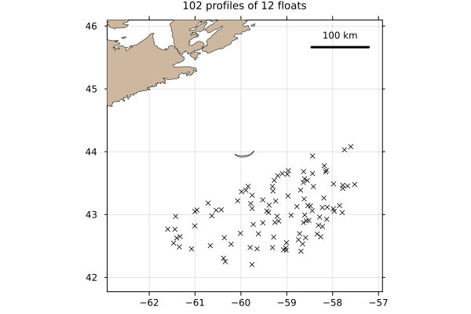
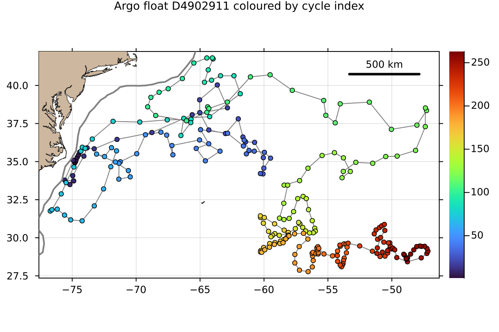
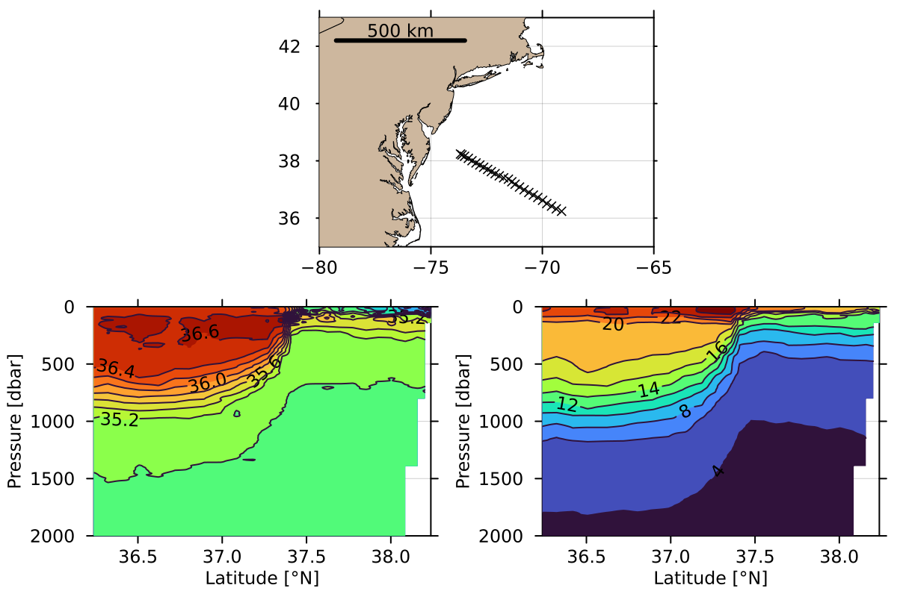

# Examples

## Satellite SST

The AMSR satellite provides several data streams, including sea-surface
temperature, which may be plotted as follows.

```julia
# North Atlantic Sea Surface Temperature
using OceanAnalysis, Plots
f = get_amsr("2025-09-07");
a = read_amsr(f, "SST");
plot_amsr(a, xlims=(290.0, 360.0), ylims=(20.0, 60.0), color=:turbo,
    levels=0.0:2.5:30.0, clim=(0, 30))
#savefig("amsr.png")
```


## Topography

The following downloads topographic data for a domain including southern
Nova Scotia, and plots in three plot styles.

```julia
using OceanAnalysis, Plots, TiffImages
topo_file = get_topography(-67, -63, 43, 46, resolution=1)
topo = read_topography(topo_file);
p1 = plot_topography(topo, domain=:both);
p2 = plot_topography(topo, domain=:sea);
p3 = plot_topography(topo, domain=:land);
plot(p1, p2, p3, layout=(1, 3), size=(800, 200), dpi=300)
#savefig("topography.png")
```


## CTD hydrography

The following shows how to read a built-in CTD file, and plot some hydrographic
diagrams.

```julia
# Read and plot a built-in CTD file
using OceanAnalysis, Plots, Measures, Dates
filename = joinpath(dirname(dirname(pathof(OceanAnalysis))),
    "data", "ctd.cnv")
ctd = read_ctd_cnv(filename)
p1 = plot_profile(ctd, which="CT");
p2 = plot_profile(ctd, which="SA");
p3 = plot_profile(ctd, which="sigma0");
p4 = plot_TS(ctd);
title = "CTD observations at " *
        "$(round(ctd.metadata["latitude"],digits=3))N and " *
        "$(round(ctd.metadata["longitude"],digits=3))E" *
        " on $(Dates.format(ctd.metadata["time"], "yyyy-mm-dd"))"
plot(p1, p2, p3, p4, layout=(2, 2), size=(800, 600), margin=0.25cm,
    dpi=200, plot_title=title, plot_titlefontsize=11)
#savefig("ctd_diagram.png")
```


## Argo search

The following shows how to map Argo profile locations made within 200 km of
Sable Island, during the past year. It also prints the IDs of those floats.

```julia
# Show Argo profiles within 200 km of Sable Island in last year
using OceanAnalysis, CSV, Dates, DataFrames, Plots
# Get the index
index_file = get_argo_index("~/data/argo")
index_all = read_argo_index(index_file) # 3.2e6 profiles
# Set time subset
today = now(UTC)
start = today - Dates.Year(1)
recent = start .< index_all.time .< today
# Set distance subset
SI_lon = -59.915
SI_lat = 43.934
radius = 200.0 # km
distance = map(i -> geod_distance(SI_lon, SI_lat,
        index_all.longitude[i], index_all.latitude[i]),
    1:nrow(index_all))
near = distance .< radius
# Filter by both time and distance
index = index_all[recent.&near, :]
# Extend region of map to show geographic context
aspect_ratio = 1.0 / cos(SI_lat * pi / 180.0)
scale = radius / 111.0
plot_stations(index.longitude, index.latitude,
    xlims=SI_lon .+ scale .* (-1.2, 1.2) .* aspect_ratio,
    ylims=SI_lat .+ scale .* (-1.2, 1.2),
    tickdirection=:out, framestyle=:box, legend=false)
float_IDs = replace.(index.file, r".*/(.*)_.*" => s"\1") |> unique;
title!("$(length(index.file)) profiles of $(length(float_IDs)) floats", titlefontsize=9)
scale_bar(100, :right, :top)
#savefig("argo_search.png")
```



## Argo trajectory

The following shows how to display a trace of the positions of a single Argo
float.

```julia
# Plot a float trajectory with colour for sequence number
using OceanAnalysis, Plots, Statistics
ID = r"D4902911" # focus on this ID
index_file = get_argo_index("~/data/argo");
index_all = read_argo_index(index_file) # 3.2e6 profiles
index = index_all[occursin.(ID, index_all.file), :]
sort!(index, :time) # this lets us join dots in time order
lon, lat = index.longitude, index.latitude
plot(lon, lat,
    aspect_ratio=1.0 / cos(mean(lat) * pi / 180),
    framestyle=:box, color=:gray, dpi=200,
    title="Argo float $(ID.pattern) coloured by cycle index", titlefontsize=9)
colors = cgrad(:turbo)
scatter!(lon, lat, marker_z=1:length(lon),
    markersize=3, markerstyle=:circle, color=colors)
# Add land and 1km isobath
plot_coastline!(coastline())
topo_file = get_topography(-110., -30, 20, 60, resolution=30,
    destdir="~/data/topo")
topo = read_topography(topo_file)
contour!(topo.metadata["longitude"], topo.metadata["latitude"],
    topo.data, xlim=xlims(), ylim=ylims(),
    color=:gray, linewidth=2, colorbar_entry=false, levels=[-1000.0])
scale_bar(500, :right, :top)
#savefig("argo_trajectory.png")
```



## Oceanographic section

The following code downloads data from a section survey in the North Atlantic
ocean. (See [https://cchdo.ucsd.edu](https://cchdo.ucsd.edu) for paths to other
sections, noting that only the data type named 'exchange' is handled by the
OceanAnalysis package.) Then it reads the data, and isolates a subset that runs
roughly orthogonal to the mean path of the Gulf Stream. Finally, it plots a
chart of sampling locations, along with cross-section diagrams of salinity and
temperature.

```julia
using OceanAnalysis, Plots
url = "https://cchdo.ucsd.edu/data/41926/90CT40_1_ct1.zip";
dir = get_section(url);
s = read_section(dir);
s.data = s.data[s["longitude"].<-68.0];
sg = grid_section(s);

p1 = plot_stations(s, xlim=(-80, -65), ylim=(35, 43));
scale_bar(500);
p2 = plot_section(sg, "salinity", ylim=(0, 2000));
p3 = plot_section(sg, "temperature", ylim=(0, 2000));
l = @layout [a; b c]
plot(p1, p2, p3, layout=l, dpi=200);
#savefig("section.png")
```


