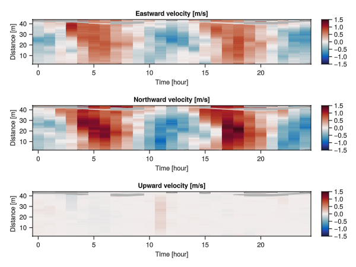
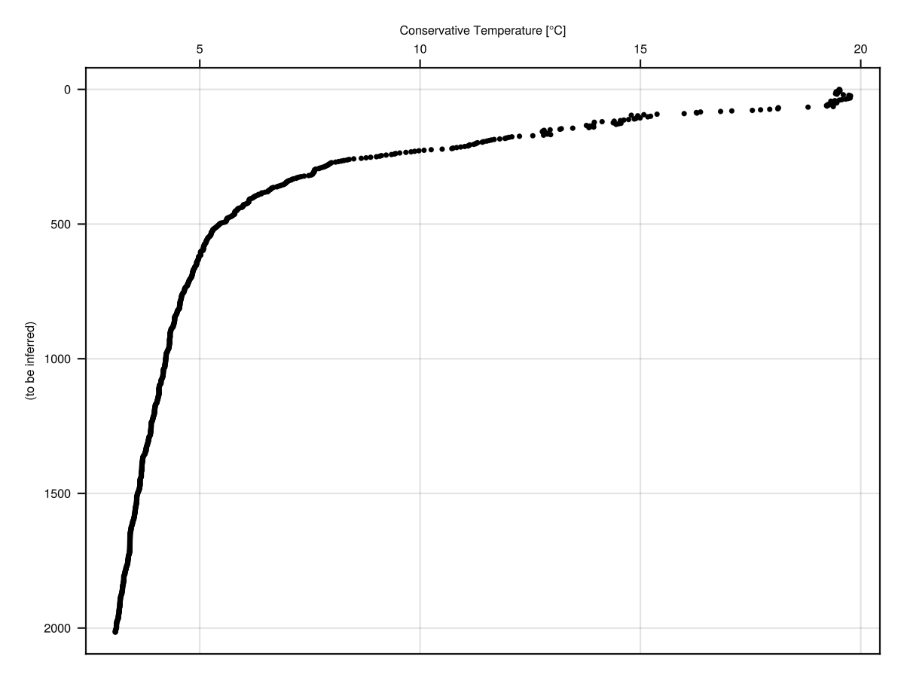
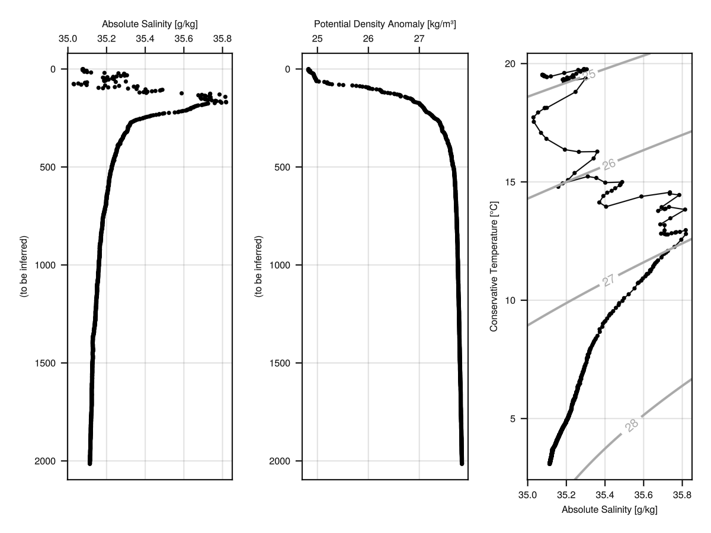
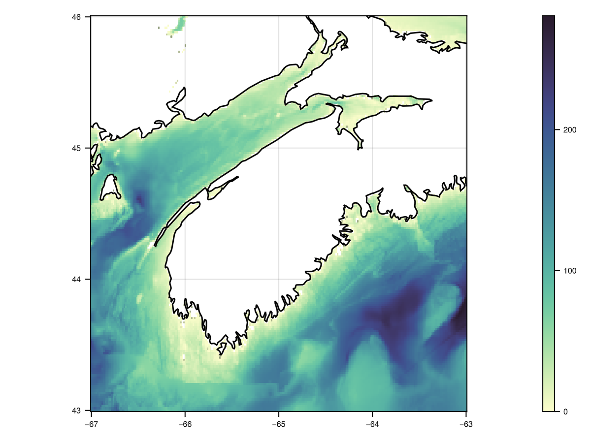
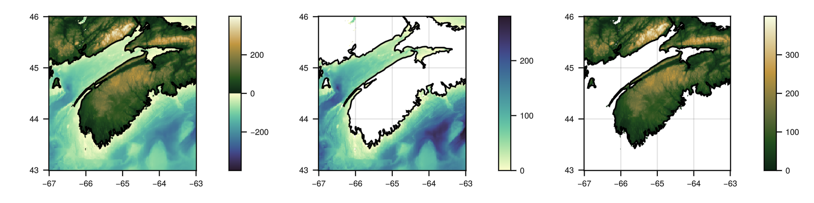

# Examples

## Acoustic-Doppler Profiler Data

A built-in file (sub-sampled to just one sample per hour, and only a single
day) is provided with the package. Below, you can see how to plot (1) images of
velocity components as a function of time and distance and (2) covariation of
eastward and northward components, with a red line indicating local coastal
orientation.

```julia
using OceanAnalysis
using GLMakie
file = joinpath(pkgdir(OceanAnalysis), "data", "adp_rdi.000")
beam = read_adp_rdi(file);
xyz = beam_to_xyz(beam);
enu = xyz_to_enu(xyz, declination=-18.1); # decl for local region

# 1. Scatterplot of u vs v
KW = (fontsize=11, markersize=2)
fig = plot_adp(enu; which=:uv, title="uv", KW...)
save("adp_rdi_uv.png", fig)

# 1. Heatmap of u, v and w
KW = (fontsize=11, colorrange=(-1.5, 1.5))
fig = Figure()
plot_adp!(fig[1, 1], enu; which=:velocity1, title="Eastward velocity [m/s]", KW...)
plot_adp!(fig[2, 1], enu; which=:velocity2, title="Northward velocity [m/s]", KW...)
plot_adp!(fig[3, 1], enu; which=:velocity3, title="Upward velocity [m/s]", KW...)
save("adp_rdi_velocity.png", fig)
```




## AMSR Satellite Data

The AMSR satellite provides several data streams, including sea-surface
temperature, which may be plotted as follows. In addition to the SST field, the
1-km isobath is also shown.

```julia
using OceanAnalysis
using GLMakie # or CairoMakie
file = get_amsr()
sst = read_amsr(file, "SST");

title = "SST " * sst["time_coverage_start"][1:10] *
        " to " * sst["time_coverage_end"][1:10] *
        " (with 1-km isobath shown)"
fig = plot_amsr(sst; limits=(275.0, 350.0, 20.0, 65.0), title=title)

# Add 1-km isobath. Note the transposition of the data (needed for Makie) and
# the redrawing, required because AMSR has 0<=lon<=360 whereas topography
# has -180<=lon<=180.
tf = get_topography()
t = read_topography(tf);
contour!(t["longitude"], t["latitude"], t.data',
    levels=[-1000.0], color=:black, linewidth=1)
contour!(360.0 .+ t["longitude"], t["latitude"], t.data',
    levels=[-1000.0], color=:black, linewidth=1)
save("amsr.png", fig, px_per_unit=2)
```


## Argo Data

### Argo summary plots

The following shows how to read an Argo NetCDF file, convert to a [`Ctd`](@ref)
object, and then create some summary plots.

```julia
# Read and plot a built-in Argo file
using OceanAnalysis, Dates, Measures, Printf
using GLMakie # or CairoMakie

# Get data
ctd = joinpath(pkgdir(OceanAnalysis), "data", "D4902911_095.nc") |>
      read_argo |>
      as_ctd;

# Non-mutating example (single panel)
fig = plot_profile(ctd; which="CT")
save("argo_profile_1.png", fig, px_per_unit=2)

# Mutating example (multiple panels)
fig = Figure()
plot_profile!(fig[1, 1], ctd; which="SA");
plot_profile!(fig[1, 2], ctd; which="sigma0");
plot_TS!(fig[1, 3], ctd);
save("argo_profile_2.png", fig, px_per_unit=2)
```





### Argo quality-control handling

The following illustrates the use of [`handle_qc`](@ref) for Argo data. The top
row shows salinity and temperature profiles, with red dots for points marked
with quality-control (QC) values other than `'1'`.  (Note that Argo QC values
are stored as characters, not as numbers.) The bottom row shows a TS diagrams
for the raw data and the cleaned-up data. Note that the salinity errors are so
large as to control the plot scales in the left-hand panels. This is not an
uncommon situation, and so it is a good idea to handle QC flags early in
analysis procedures. However, sometimes the flags seem to be in error, and so a
prudent analyst will start by plotting as in the top row.  *Exercise:* add a
middle row showing just the cleaned-up profiles.

```julia
# Illustrate QC processing of hydrographic data
using OceanAnalysis
using GLMakie # or CairoMakie
f = joinpath(pkgdir(OceanAnalysis), "data", "D4901076_139.nc")
argo = read_argo(f);
ctd = as_ctd(argo);
ctd_clean = handle_qc(ctd);
summarize(ctd)
summarize(ctd_clean)

fig = Figure() # will fill with 4 panels

plot_profile!(fig[1, 1], ctd; which="salinity")
badS = ctd["salinity_qc"] .!= '1';
scatter!(ctd["salinity"][badS], ctd["pressure"][badS], color=:red, markersize=2)

plot_profile!(fig[1, 2], ctd; which="temperature")
badT = ctd["temperature_qc"] .!= '1';
scatter!(ctd["temperature"][badT], ctd["pressure"][badT], color=:red, markersize=2)

plot_TS!(fig[2, 1], ctd)
bad = badS .| badT;
scatter!(ctd["SA"][bad], ctd["CT"][bad], color=:red, markersize=2)

plot_TS!(fig[2, 2], ctd_clean)

save("argo_qc.png", fig, px_per_unit=2)
```


### Argo Search

The following shows how to map Argo profile locations made within 200 km of
Sable Island, during the past year.

```julia
# Show Argo profiles within 200 km of Sable Island in last 5 years
using OceanAnalysis, CSV, DataFrames, Dates, Printf
using GLMakie # or CairoMakie
radius = 200 # km
years = 5 # years
# Get the index
index_file = get_argo_index("~/data/argo")
index_all = read_argo_index(index_file)
# Set time subset
today = now(UTC)
start = today - Dates.Year(years)
recent = start .< index_all.time .< today
# Set distance subset
lon0 = -59.915
lat0 = 43.934
radius = 200.0 # km
distance = map(i -> geod_distance(lon0, lat0,
        index_all.longitude[i], index_all.latitude[i]),
    1:nrow(index_all))
near = distance .< radius
# Filter by both time and distance
index = index_all[recent.&near, :]

# Extend region of map to show geographic context
t = "$(length(index.file)) profiles within $radius km of Sable Island in $years years"
fig = plot_coastline(coastline(), title=t,
    limits=[lon0 - 3; lon0 + 3; lat0 - 3; lat0 + 3])
scatter!(index.longitude, index.latitude)

save("argo_search.png", fig, px_per_unit=2)
```


### Argo Trajectory

The following shows how to display a trace of the positions of a single Argo
float.

```julia
# Plot a float trajectory with colour for sequence number
using OceanAnalysis, Printf, Statistics
using GLMakie # CairoMakie
ID = r"D4902911" # focus on this ID
index_file = get_argo_index("~/data/argo");
index_all = read_argo_index(index_file) # 3.2e6 profiles
index = index_all[occursin.(ID, index_all.file), :]
sort!(index, :time) # this lets us join dots in time order
lon, lat = index.longitude, index.latitude
lonr = extrema(lon)
latr = extrema(lat)
fig = plot_coastline(coastline(),
    scalebar=(distance=500, x=:right, y=:top),
    limits=[lonr[1] - 2; lonr[2] + 2; latr[1] - 2; latr[2] + 4])
scatterlines!(lon, lat)

save("argo_trajectory.png", fig, px_per_unit=2)
```


## Bathymetry (high-resolution) Data

### High-resolution bathymetry data

Bathymetry files at 10m and 100m resolution are provided for some Canadian
waters via a somewhat-awkward GUI interface at
<https://data.chs-shc.ca/dashboard/map>. The following shows how to plot such data, after downloading a dataset.  (This only works for the TIFF form of the data.)

```julia
using OceanAnalysis
using GLMakie # or CairoMakie
filename = expanduser("~/data/nonna/NONNA10_4460N06360W.tiff")
if isfile(filename)
    n = read_nonna(filename)
    fig = heatmap(n["longitude"], n["latitude"], permutedims(n.data), colormap=:turbo,
        axis=(aspect=DataAspect(),))
    save("nonna.png", fig)
end
```


### Bathymetry (low-resolution) and topography data

The following downloads topographic data for a domain including southern
Nova Scotia, and displays the data in three plot styles.

```julia
using OceanAnalysis, GLMakie
topo_file = get_topography(-67, -62, 43, 46, resolution=1)
topo = read_topography(topo_file);

# Single panel
fig = plot_topography(topo) # domain defaults to :land_and_sea
save("topography_1.png", fig, px_per_unit=2)

# Multiple panels
fig = Figure(size=(800, 200))
plot_topography!(fig[1, 1], topo, domain=:land_and_sea) # same as above
plot_topography!(fig[1, 2], topo, domain=:sea)
plot_topography!(fig[1, 3], topo, domain=:land)
save("topography_2.png", fig, px_per_unit=2)
```






## Coastline Data

The following produces a Canada-wide view on the left, with a red inset marker
for Nova Scotia, and then a Nova Scotia view on the right. Thin lines are used
    to show details of the wiggly coastlines.

```julia
using OceanAnalysis
using GLMakie # or CairoMakie
cl = coastline();

fig = Figure()
L = (-140, -50, 43, 76) # plot limits: east, west, south, north
l = (-67, -58, 43, 47.5)
# Left panel
plot_coastline!(fig[1, 1], cl, limits=L, linewidth=0.2) # thin lines are prettier
lines!([l[1], l[1], l[2], l[2], l[1]], [l[3], l[4], l[4], l[3], l[3]], color=:red)
# Right panel
plot_coastline!(fig[1, 2], cl, limits=l, scalebar=true)

save("coastline.png", fig, px_per_unit=5)
```


## CTD Data

The following shows how to read a built-in CTD file, and plot some hydrographic diagrams.

### CTD profiles


```julia
# Read and plot a built-in CTD file
using OceanAnalysis, Printf
using GLMakie # or CairoMakie
filename = joinpath(pkgdir(OceanAnalysis), "data", "ctd.cnv")
ctd = read_ctd_cnv(filename);
fig = Figure()
plot_profile!(fig[1, 1], ctd; which="CT");
plot_profile!(fig[1, 2], ctd; which="SA");
plot_profile!(fig[1, 3], ctd; which="sigma0");
save("ctd_profiles.png", fig, px_per_unit=2)
```


### CTD smoothing

The following shows how to grid CTD data in 1-dbar intervals; note that the
mean spacing of the data is 0.24 dbar. Note the trick of using uniform `y`
values, so that `interpolate_barnes()` will effectively do a one-dimensional
analysis of the variation of Absolute Salinity with sea pressure.

```julia
# Smooth to 1-dbar grid; note that mean(diff(p))=0.24 dbar.
using OceanAnalysis
using GLMakie # or CairoMakie
file = joinpath(pkgdir(OceanAnalysis), "data", "ctd.cnv")
ctd = read_ctd_cnv(file);
p = ctd["pressure"];
y = repeat([1], length(p)); # fake y data, with arbitrary value
SA = ctd["SA"];
dp = 1.0;
pg = range(0.0, maximum(p), step=dp);
g = interpolate_barnes(p, y, SA; xg=pg, xr=dp);
fig = plot_profile(ctd, which="SA", seriestype=:scatter)
lines!(g["zg"][:], g["xg"][:], color=:red, label=false)
save("ctd_smooth.png", fig, px_per_unit=2)
```


### CTD temperature-salinity diagram

The colours in the diagram indicate sea pressure, in decibars. Zero-width
marker borders are used to avoid having black ink obscuring the colours.

```julia
# Read and plot a built-in CTD file
using OceanAnalysis
using Printf
using GLMakie # or CairoMakie
filename = joinpath(pkgdir(OceanAnalysis), "data", "ctd.cnv")
ctd = read_ctd_cnv(filename);
title = @sprintf("CTD observations at %.3fN and %.3fE",
    ctd["latitude"], ctd["longitude"])
fig = plot_TS(ctd, title=title)
save("ctd_TS.png", fig, px_per_unit=2)
```


## Digital Elevation Model Data

This example is based on a large file (not provided with this package) that was obtained via a GUI interface at [https://nsgi.novascotia.ca/datalocator/elevation/](https://nsgi.novascotia.ca/datalocator/elevation/). The view is of a portion of Halifax, Nova Scotia. The polygonal shape is the Halifax Citadel, a fort built in 1820s for protection against the United States military. The code below produces two diagrams. The first shows elevation, revealing that the Citadel sits atop a hill (which, a broader view would show, overlooks Halifax Harbour), while the second shows more detail on small-scale features of the old fort and the modern roads and building in downtown Halifax.

```julia
using OceanAnalysis
using GLMakie # or CairoMakie

file = "/Users/kelley/data/lidar/1044600063500_201901_DEM/1044600063500_201901_DEM.tif"

if isfile(file)
    dem_all = read_dem(file)
    # Focus near the Citadel fort
    lims = (-63.589, -63.572, 44.6426, 44.655)
    dem = subset_dem(dem_all, lonlim=lims[1:2], latlim=lims[3:4])
    fig1 = plot_dem(dem)
    save("dem_1.png", fig1, px_per_unit=2)
    fig2 = plot_dem(dem, coordinates=:geographic)
    save("dem_2.png", fig2, px_per_unit=2)
end
```


## Echosounder Data

This uses a private data file acquired using a Biosonics scientific echosounder.

```julia
# This uses a private file
using OceanAnalysis, CairoMakie
f = "/Users/kelley/Dropbox/data/archive/sleiwex/2008/fielddata/2008-07-01/Merlu/Biosonics/20080701_163942.dt4"
if isfile(f)
    e = read_echosounder(f)
    fig = plot_echosounder(e)
    save("echosounder.png", fig)
end
```


## Section Data

The following code downloads data from a section survey in the North Atlantic
ocean. (See [https://cchdo.ucsd.edu](https://cchdo.ucsd.edu) for paths to other
sections, noting that only the data type named 'exchange' is handled by the
OceanAnalysis package.) Then it reads the data, and isolates a subset that runs
roughly orthogonal to the mean path of the Gulf Stream. Finally, it plots a
chart of sampling locations, along with cross-section diagrams of salinity and
temperature.

```julia
using OceanAnalysis
using GLMakie # or CairoMakie
url = "https://cchdo.ucsd.edu/data/41926/90CT40_1_ct1.zip"; # exchange format
dir = get_section(url);
s = read_section(dir);
s.data = s.data[s["longitude"].<(-68.0)];
# We must grid to get the cross-section diagrams
sg = grid_section(s);
fig = plot_section(sg, which="salinity", type=:contourf)
save("section.png", fig, px_per_unit=2)
```


## Tide Gauge (sealevel) Data

### Map of stations

This the locations of tide gauges in the Maritimes region of Canada.  Blue dots
represent non-permanent tide gauges, while red dots represent permanent tide
gauges.  (As an exercise, restrict `i` according to latitude and longitude
criteria, and then examine `i.name` to see the tide gauges in that region.)

```julia
using OceanAnalysis
using GLMakie # or CairoMakie
cl = coastline()
i = get_tide_gauge_index(:all); # requires internet access

limits = (-67, -59, 43.3, 47.2)
fig = plot_coastline(cl, limits=limits, scalebar=true, fontsize=12,
    title="Tide gauges (red for permanent stations)")
scatter!(i.longitude, i.latitude, color=:blue, markersize=8)
look = i.type .== "PERMANENT"
scatter!(i.longitude[look], i.latitude[look], color=:red, markersize=18)

save("tide_gauge_locations.png", fig, px_per_unit=5)
```


### Plot elevation record

This shows how to download a week's worth of data for the Bedford Institute
tide gauge, and plot it as a timeseries. (As an exercise, repeat the call to
`get_tide_gauge_file()` with a specific `times` value. If you ask for too long
an interval, the CHS server may report an error, in which case you ought to try
increasing the value of `resolution`.)

```julia
using OceanAnalysis, CSV, DataFrames
using GLMakie # or CairoMakie

search = "Bedford" # full name is "Bedford Institute"
name, csv = get_tide_gauge_file(search)
data = CSV.read(csv, DataFrame)

fig = Figure()
ax = Axis(fig[1, 1], ylabel="Elevation [m]", title="Sea Level at $name")
lines!(data.time, data.value)

save("tide_gauge_timeseries.png", fig, px_per_unit=5)
```


