# Examples

## Acoustic-Doppler Profiler Data

A built-in file (sub-sampled to just one sample per hour, and only a single
day) is provided with the package. Below, you can see how to plot (1) images of
velocity components as a function of time and distance and (2) covariation of
eastward and northward components, with a red line indicating local coastal
orientation.

```julia
using OceanAnalysis, Plots
file = joinpath(dirname(dirname(pathof(OceanAnalysis))),
    "data", "adp_rdi.000")
beam = read_adp_rdi(file);
xyz = beam_to_xyz(beam);
enu = xyz_to_enu(xyz, declination=-18.1); # decl for local region

# 1. Heatmap of u, v and w
plot_adp(enu; size=(800, 700), dpi=150)
savefig("adp_rdi_heatmap.png")

# 2. U-V scattergraph, with local coastline direction shown

# In R, find angle of coastline for Île-aux-Lièvres
#   load("/Users/kelley/git/oar_book/data/coastlineSLE.rda")
#   plot(coastlineSLE,clon=-69.7,clat=47.79,span=100)
#   ial <- locator(2) # click on ends of IAL
#   xy <- lonlat2utm(lon=ial$x,lat=ial$y)
#   a <- diff(xy$northing)/diff(xy$easting)
plot_adp(enu, which=:uv)
a = 1.71 # from the R code shown above (private file)
plot!([-1; 1], [-a; a], color=:red, label=false, dpi=150)
savefig("adp_rdi_uv.png")
```

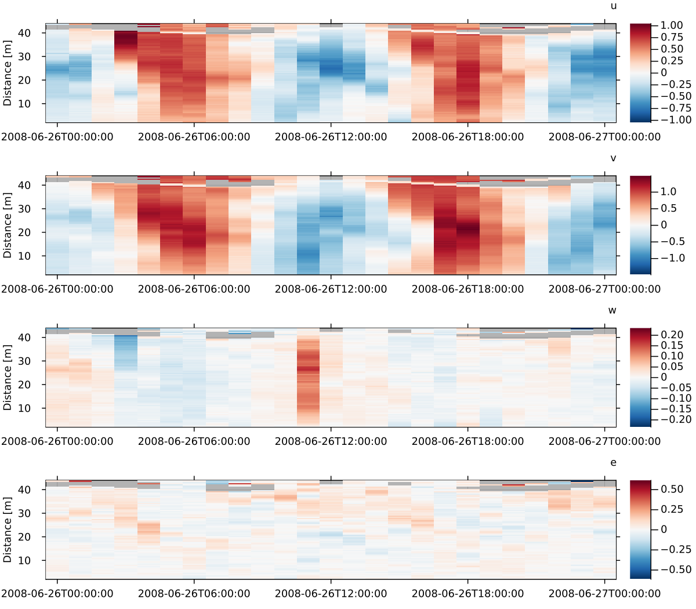
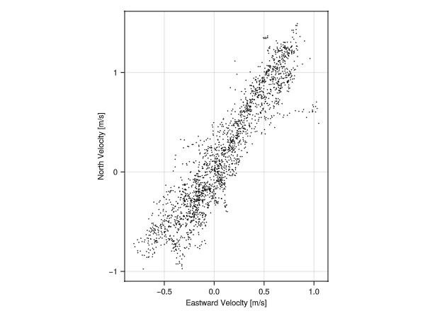

## AMSR Satellite Data

The AMSR satellite provides several data streams, including sea-surface
temperature, which may be plotted as follows. In addition to the SST field, the
1-km isobath is also shown.

```julia
using OceanAnalysis, CairoMakie
file = get_amsr()
sst = read_amsr(file, "SST");
fig = plot_amsr(sst; xlims=(275.0, 350.0),
    ylims=(20.0, 65.0), colorrange=(-2.0, 30.0),
    title="Sea-surface Temperature [°C] with 1-km isobath")
# Add 1-km isobath. Note the transposition of the data (for Makie)
# and the redrawing, to handle the fact that AMSR has 0<=lon<=360
# whereas topograph has -180<=lon<=180.
ax = fig[1, 1]
tf = get_topography()
t = read_topography(tf);
contour!(ax, t["longitude"], t["latitude"], t.data',
    levels=[-1000.0], color=:black, linewidth=1)
contour!(ax, 360.0 .+ t["longitude"], t["latitude"], t.data',
    levels=[-1000.0], color=:black, linewidth=1)
save("amsr.png", fig)
```


## Argo Data

### Argo Profile

The following shows how to read an Argo NetCDF file, convert to a [`Ctd`](@ref) object, and then make a summary plot.

```julia
# Read and plot a built-in Argo file
using OceanAnalysis, Dates, Measures, Plots, Printf
filename = joinpath(dirname(dirname(pathof(OceanAnalysis))), "data",
    "D4902911_095.nc")
argo = read_argo(filename)
ctd = as_ctd(argo)
p1 = plot_profile(ctd; which="CT");
p2 = plot_profile(ctd; which="SA");
p3 = plot_profile(ctd; which="sigma0");
p4 = plot_TS(ctd);
title = @sprintf("CTD observations at %.3fN and %.3fE, on %s",
    ctd.metadata["latitude"], ctd.metadata["longitude"],
    Dates.format(ctd.metadata["time"], "yyyy-mm-dd"))
plot(p1, p2, p3, p4, layout=(2, 2), size=(800, 600), margin=0.25cm,
    dpi=200, plot_title=title, plot_titlefontsize=9)
savefig("argo_profile.png")
```


### Argo quality-control handling

The following illustrates the use of [`handle_qc`](@ref) for Argo data. The top
row shows salinity and temperature profiles, with red dots for points marked
with quality-control (QC) values other than `'1'`.  (Note that Argo QC values
are stored as characters, not as numbers.) The bottom row shows a TS diagrams
for the raw data and the cleaned-up data. Note that the salinity errors are so
large as to control the plot scales in the left-hand panels. This is not an
uncommon situation, and so it is a good idea to handle QC flags early in
analysis procedures. However, sometimes the flags seem to be in error, and so a
prudent analyst will start by plotting as in the top row.  *Exercise:* add a
middle row showing just the cleaned-up profiles.

plotting 

```julia
# Illustrate QC processing of hydrographic data
using OceanAnalysis, Plots
f = joinpath(dirname(dirname(pathof(OceanAnalysis))), "data", "D4901076_139.nc")
argo = read_argo(f);
ctd = as_ctd(argo);
ctd_clean = handle_qc(ctd);

ul = plot_profile(ctd; which="salinity", dpi=200, fontsize=6)
badS = ctd["salinity_qc"] .!= '1'
scatter!(ctd["salinity"][badS], ctd["pressure"][badS], color=:red, markersize=2)

ur = plot_profile(ctd; which="temperature", dpi=200, fontsize=6)
badT = ctd["temperature_qc"] .!= '1'
scatter!(ctd["temperature"][badT], ctd["pressure"][badT], color=:red, markersize=2)

ll = plot_TS(ctd, fontsize=6)
bad = badS .| badT
scatter!(ctd["SA"][bad], ctd["CT"][bad], color=:red, markersize=2)

lr = plot_TS(ctd_clean, fontsize=6)

plot(ul, ur, ll, lr, layout=(2, 2))
savefig("argo_qc.png")


```

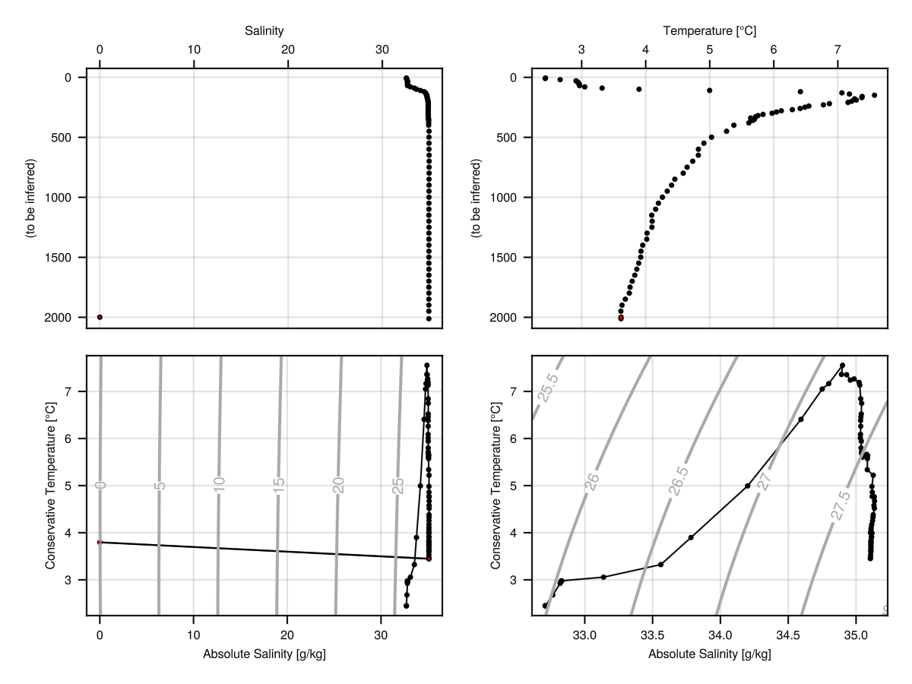


### Argo Search

The following shows how to map Argo profile locations made within 200 km of
Sable Island, during the past year.

```julia
# Show Argo profiles within 200 km of Sable Island in last year
using OceanAnalysis, CSV, Dates, DataFrames, Plots, Printf
# Get the index
index_file = get_argo_index("~/data/argo")
index_all = read_argo_index(index_file) # 3.2e6 profiles
# Set time subset
today = now(UTC)
start = today - Dates.Year(1)
recent = start .< index_all.time .< today
# Set distance subset
SI_lon = -59.915
SI_lat = 43.934
radius = 200.0 # km
distance = map(i -> geod_distance(SI_lon, SI_lat,
        index_all.longitude[i], index_all.latitude[i]),
    1:nrow(index_all))
near = distance .< radius
# Filter by both time and distance
index = index_all[recent.&near, :]
# Extend region of map to show geographic context
aspect_ratio = 1.0 / cos(SI_lat * pi / 180.0)
scale = radius / 111.0
plot_stations(index.longitude, index.latitude,
    xlims=SI_lon .+ scale .* (-1.2, 1.2) .* aspect_ratio,
    ylims=SI_lat .+ scale .* (-1.2, 1.2))
float_IDs = replace.(index.file, r".*/(.*)_.*" => s"\1") |> unique;
t = @sprintf("%d profiles of %d floats", length(index.file), length(float_IDs))
title!(t, titlefontsize=9)
scale_bar(100; x=:right, y=:top)
savefig("argo_search.png")
```


### Argo Trajectory

The following shows how to display a trace of the positions of a single Argo
float.

```julia
# Plot a float trajectory with colour for sequence number
using OceanAnalysis, Plots, Printf, Statistics
ID = r"D4902911" # focus on this ID
index_file = get_argo_index("~/data/argo");
index_all = read_argo_index(index_file) # 3.2e6 profiles
index = index_all[occursin.(ID, index_all.file), :]
sort!(index, :time) # this lets us join dots in time order
lon, lat = index.longitude, index.latitude
plot(lon, lat,
    aspect_ratio=1.0 / cos(mean(lat) * pi / 180),
    framestyle=:box, color=:gray, dpi=200,
    title=@sprintf("Argo float %s coloured by cycle index", ID.pattern),
    titlefontsize=9)
colors = cgrad(:turbo)
scatter!(lon, lat, marker_z=1:length(lon),
    markersize=3, markerstyle=:circle, color=colors)
# Add land and 1km isobath
plot_coastline!(coastline())
topo_file = get_topography(-110.0, -30, 20, 60, resolution=30,
    destdir="~/data/topo")
topo = read_topography(topo_file)
contour!(topo.metadata["longitude"], topo.metadata["latitude"],
    topo.data, xlim=xlims(), ylim=ylims(),
    color=:gray, linewidth=2, colorbar_entry=false, levels=[-1000.0])
scale_bar(500; x=:right, y=:top)
savefig("argo_trajectory.png")
```


## Bathymetry (high-resolution) Data

### High-resolution bathymetry data

Bathymetry files at 10m and 100m resolution are provided for some Canadian
waters via a somewhat-awkward GUI interface at
<https://data.chs-shc.ca/dashboard/map>. The following shows how to plot such data, after downloading a dataset.  (This only works for the TIFF form of the data.)


```julia
using OceanAnalysis, Plots
filename = expanduser("~/data/nonna/NONNA10_4460N06360W.tiff")
n = read_nonna(filename);
heatmap(n["longitude"], n["latitude"], n.data, c=:turbo,
    size=(400, 400), dpi=300, framestyle=:box, tickdirection=:out)
savefig("nonna.png")
```

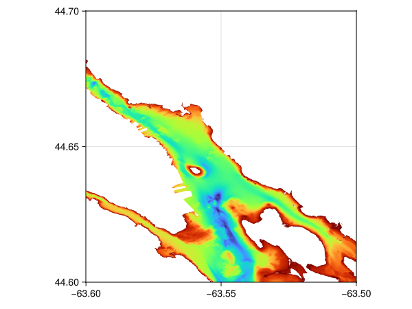

### Bathymetry (low-resolution) and topography data

The following downloads topographic data for a domain including southern
Nova Scotia, and displays the data in three plot styles.

```julia
using OceanAnalysis, Plots, TiffImages
topo_file = get_topography(-67, -63, 43, 46, resolution=1)
topo = read_topography(topo_file);
p1 = plot_topography(topo, domain=:both);
p2 = plot_topography(topo, domain=:sea);
p3 = plot_topography(topo, domain=:land);
plot(p1, p2, p3, layout=(1, 3), size=(800, 200), dpi=200)
savefig("topography.png")
```


## Coastline Data

The following produces a world map in Cartesian coordinates, with aspect ratio set so that shapes and relative sizes are appropriate at the equator.

```julia
using OceanAnalysis, Plots
c = coastline()
plot_coastline(c)
savefig("coastline.png")
```

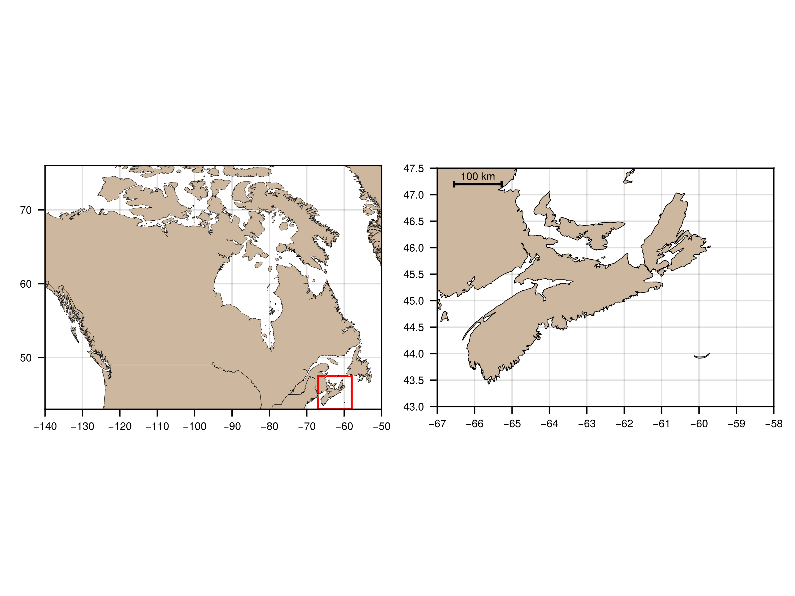


## CTD Data

The following shows how to read a built-in CTD file, and plot some hydrographic diagrams.

### CTD profiles

```julia
# Read and plot a built-in CTD file
using OceanAnalysis, Measures, Plots, Printf
filename = joinpath(dirname(dirname(pathof(OceanAnalysis))),
    "data", "ctd.cnv")
ctd = read_ctd_cnv(filename);
p1 = plot_profile(ctd; which="CT");
p2 = plot_profile(ctd; which="SA");
p3 = plot_profile(ctd; which="sigma0");
title = @sprintf("CTD observations at %.3fN and %.3fE",
    ctd["latitude"], ctd["longitude"])
plot(p1, p2, p3, layout=(1, 3), size=(800, 600), margin=0.25cm,
    dpi=150, plot_title=title, plot_titlefontsize=11)
savefig("ctd_profiles.png")
```

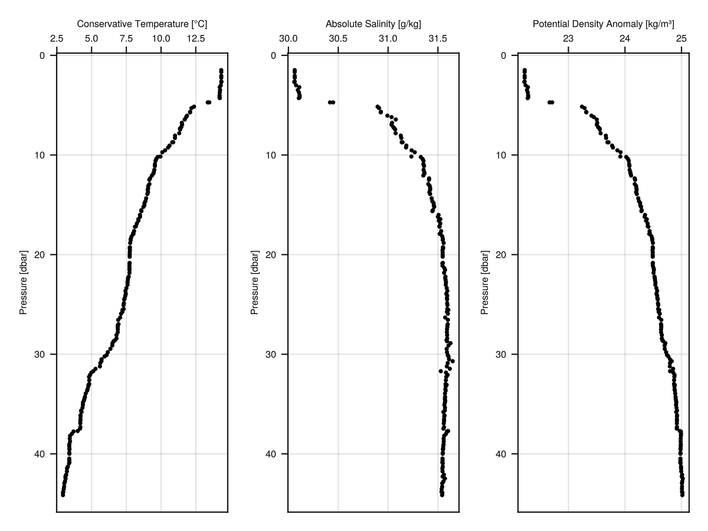

### CTD smoothing

The following shows how to grid CTD data in 1-dbar intervals; note that the
mean spacing of the data is 0.24 dbar. Note the trick of using uniform `y` values, so that `interpolate_barnes()` will effectively do a one-dimensional
analysis of the variation of Absolute Salinity with sea pressure.

```julia
using OceanAnalysis, Plots
file = joinpath(dirname(dirname(pathof(OceanAnalysis))), "data", "ctd.cnv")
ctd = read_ctd_cnv(file);
p = ctd["pressure"];
y = repeat([1], length(p)); # fake y data, with arbitrary value
SA = ctd["SA"];
dp = 1.0;
pg = range(0.0, maximum(p), step=dp);
g = interpolate_barnes(p, y, SA; xg=pg, xr=dp);
plot_profile(ctd, which="SA", seriestype=:scatter)
plot!(g["zg"][:], g["xg"][:], color=:red, label=false)
savefig("ctd_smooth.png")
```

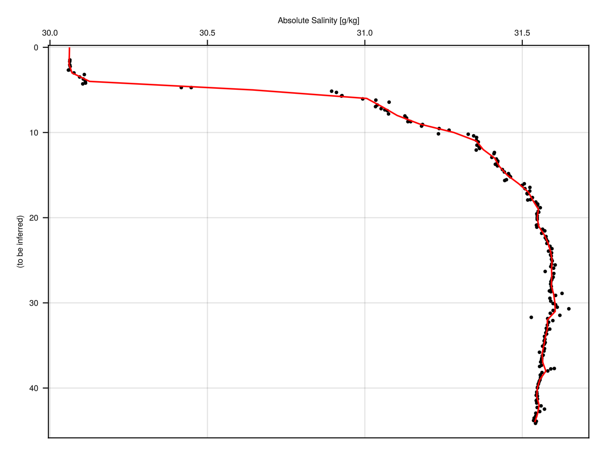


### CTD temperature-salinity diagram

The colours in the diagram indicate sea pressure, in decibars. Zero-width
marker borders are used to avoid having black ink obscuring the colours.

```julia
# Read and plot a built-in CTD file
using OceanAnalysis, Measures, Plots, Printf
filename = joinpath(dirname(dirname(pathof(OceanAnalysis))), "data", "ctd.cnv")
ctd = read_ctd_cnv(filename);
title = @sprintf("CTD observations at %.3fN and %.3fE",
    ctd["latitude"], ctd["longitude"])
plot_TS(ctd, ms=3, title=title, markerstrokewidth=0, color_by="pressure")
savefig("ctd_TS.png")
```

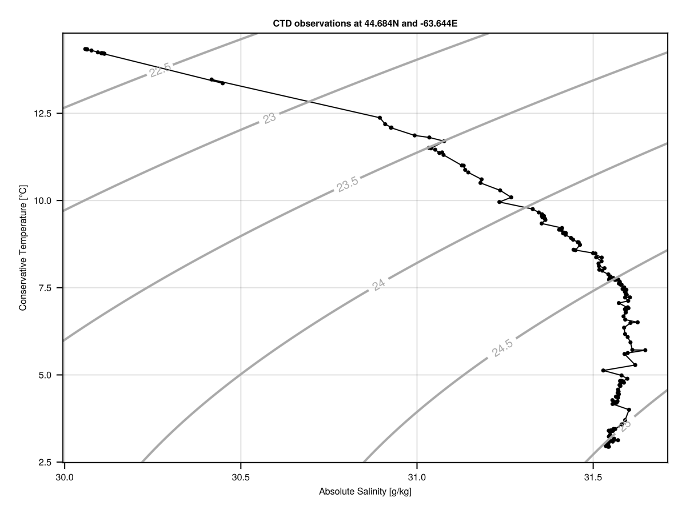


## Digital Elevation Model Data

This example is based on a large file (not provided with this package) that was obtained via a GUI interface at [https://nsgi.novascotia.ca/datalocator/elevation/](https://nsgi.novascotia.ca/datalocator/elevation/). The view is of a portion of Halifax, Nova Scotia. The polygonal shape is the Halifax Citadel, a fort built in 1820s for protection against the United States military. The code below produces two diagrams. The first shows elevation, revealing that the Citadel sits atop a hill (which, a broader view would show, overlooks Halifax Harbour), while the second shows more detail on small-scale features of the old fort and the modern roads and building in downtown Halifax.

```julia
using OceanAnalysis, Plots

file = "/Users/kelley/Downloads/1044600063500_201901_DEM/1044600063500_201901_DEM.tif"

if isfile(file)
    dem_all = read_dem(file)
    # Focus near the Citadel fort
    dem = subset_dem(dem_all, lonlim=(-63.589, -63.572), latlim=(44.6426, 44.655))
    middle_lat = dem["latitude"][div(end + 1, 2)]
    aspect_ratio = 1.0 / cos(middle_lat * pi / 180.0)
    # Heatmap of elevation
    p1 = heatmap(dem["longitude"], dem["latitude"], dem.data,
        color=:inferno, aspect_ratio=aspect_ratio,
        framestyle=:box, tickdirection=:out)
    savefig("dem_1.png")
    # Heatmap of gradient of elevation with respect to northerly distance
    z = -diff(dem.data, dims=1) / dem["dy"]
    z = [zeros(1, size(dem.data, 2)); z]
    heatmap(dem["longitude"], dem["latitude"], z,
        color=:inferno, aspect_ratio=aspect_ratio,
        framestyle=:box, tickdirection=:out, clim=(-0.5, 0.5))
    savefig("dem_2.png")
end
```

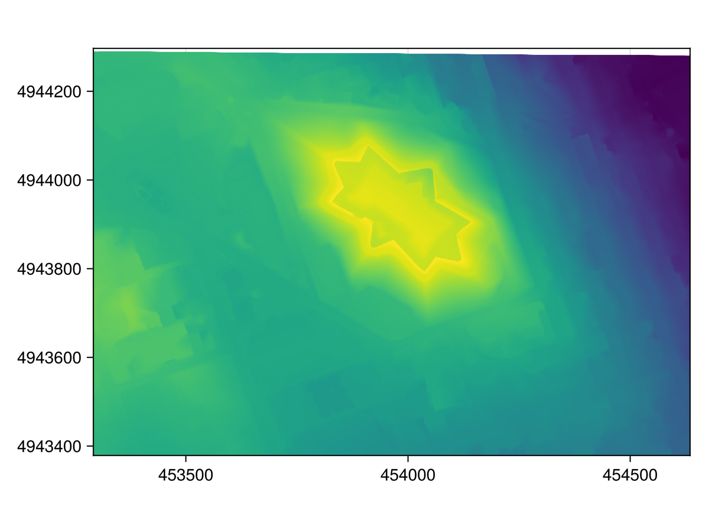

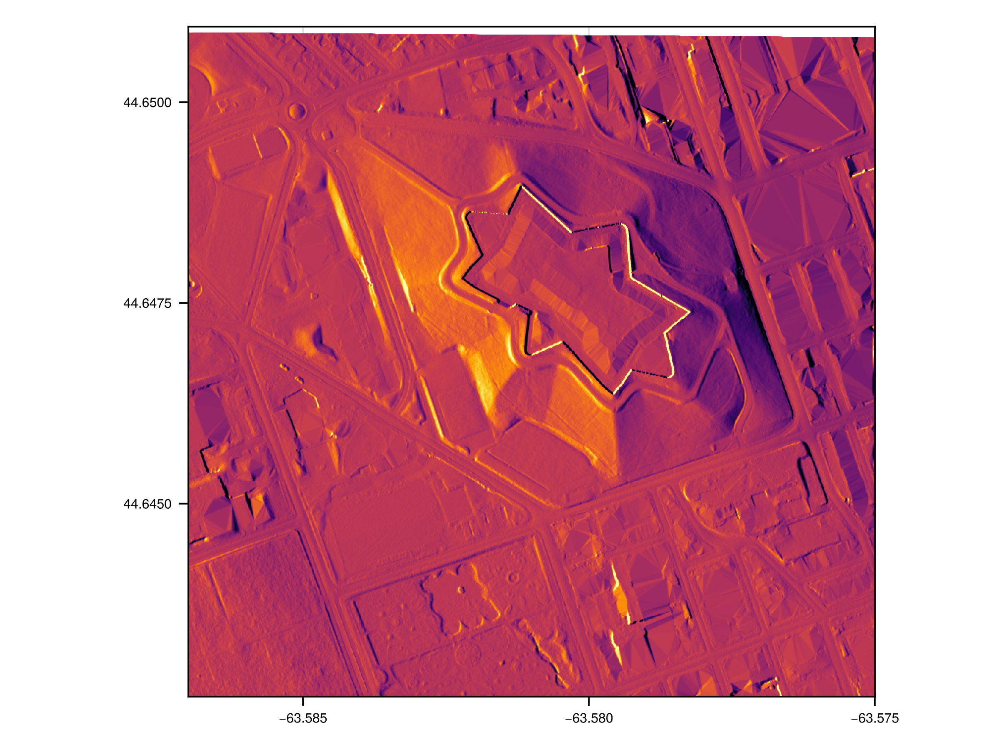


## Echosounder Data

This uses a private data file acquired using a Biosonics scientific echosounder.

```julia
# This uses a private file
using OceanAnalysis, Plots
f = "/Users/kelley/Dropbox/data/archive/sleiwex/2008/fielddata/2008-07-01/Merlu/Biosonics/20080701_163942.dt4"
if isfile(f)
    e = read_echosounder(f)
    plot_echosounder(e)
    savefig("echosounder.png")
end
```

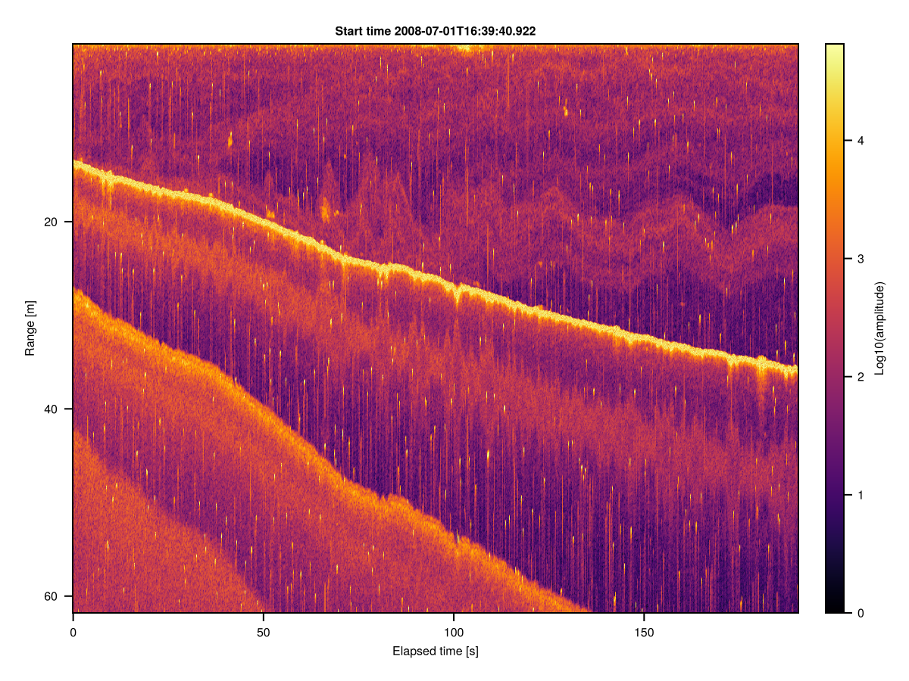


## Section Data

The following code downloads data from a section survey in the North Atlantic
ocean. (See [https://cchdo.ucsd.edu](https://cchdo.ucsd.edu) for paths to other
sections, noting that only the data type named 'exchange' is handled by the
OceanAnalysis package.) Then it reads the data, and isolates a subset that runs
roughly orthogonal to the mean path of the Gulf Stream. Finally, it plots a
chart of sampling locations, along with cross-section diagrams of salinity and
temperature.

```julia
using OceanAnalysis, Plots
url = "https://cchdo.ucsd.edu/data/41926/90CT40_1_ct1.zip";
dir = get_section(url);
s = read_section(dir);
s.data = s.data[s["longitude"].<-68.0];
sg = grid_section(s);

p1 = plot_stations(s, xlim=(-80, -65), ylim=(35, 43));
scale_bar(500);
p2 = plot_section(sg, "salinity", ylim=(0, 2000));
p3 = plot_section(sg, "temperature", ylim=(0, 2000));
l = @layout [a; b c]
plot(p1, p2, p3, layout=l, dpi=200);
savefig("section.png")
```


## Tide Gauge (sealevel) Data

### Map of stations

This the locations of tide gauges in the Maritimes region of Canada.  Blue dots
represent non-permanent tide gauges, while red dots represent permanent tide
gauges.  (As an exercise, restrict `i` according to latitude and longitude
criteria, and then examine `i.name` to see the tide gauges in that region.)


```julia
using OceanAnalysis, Plots
i = get_tide_gauge_index(:all);
scatter(i.longitude, i.latitude,
    aspect_ratio=1.0 / cos(45.0 * pi / 180),
    framestyle=:box, tickdirection=:out, label=false, ms=0,
    xlim=(-67, -59), ylim=(43.3, 47.2))
plot_coastline!(coastline(:global_fine), fillcolor=:gray95)
scatter!(i.longitude, i.latitude, color=:blue, ms=3,
    markerstrokewidth=0.2)
look = i.type .== "PERMANENT"
scatter!(i.longitude[look], i.latitude[look],
    color=:red, ms=4, markerstrokewidth=0.2)
savefig("tide_gauge_locations.png")
```

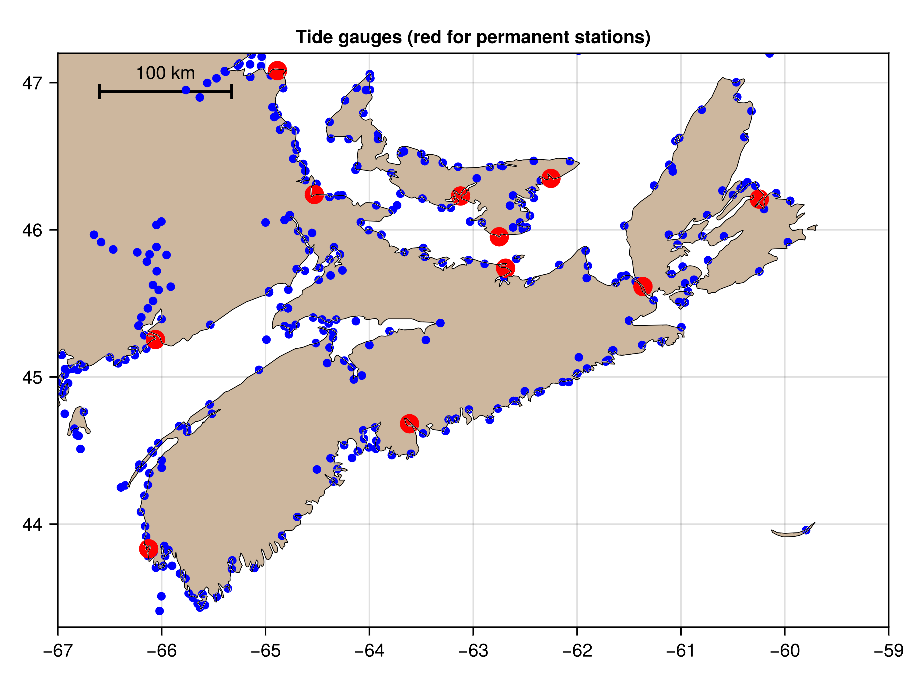

### Plot elevation record

This shows how to download a week's worth of data for the Bedford Institute
tide gauge, and plot it as a timeseries. (As an exercise, repeat the call to
`get_tide_gauge_file()` with a specific `times` value. If you ask for too long
an interval, the CHS server may report an error, in which case you ought to try
increasing the value of `resolution`.)

```julia
using OceanAnalysis, Plots, CSV, DataFrames
search = "Bedford" # full name is "Bedford Institute"
name, csv = get_tide_gauge_file(search)
data = CSV.read(csv, DataFrame)
xlim = extrema(data.time)
plot(data.time, data.value, xlim=xlim, label=false,
    framestyle=:box, tickdirection=:out, ylab="Elevation [m]",
    title=name, labelfontsize=8, titlefontsize=8)
savefig("tide_gauge_timeseries.png")
```

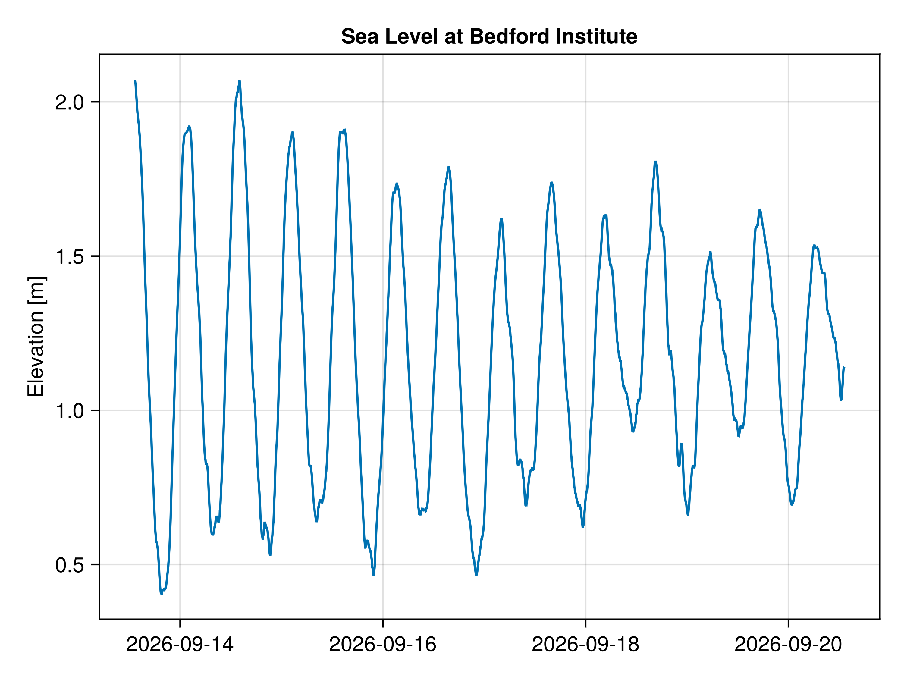


