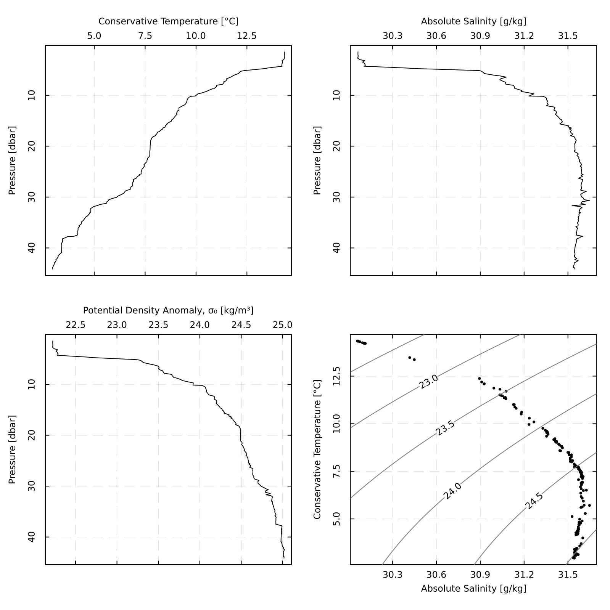
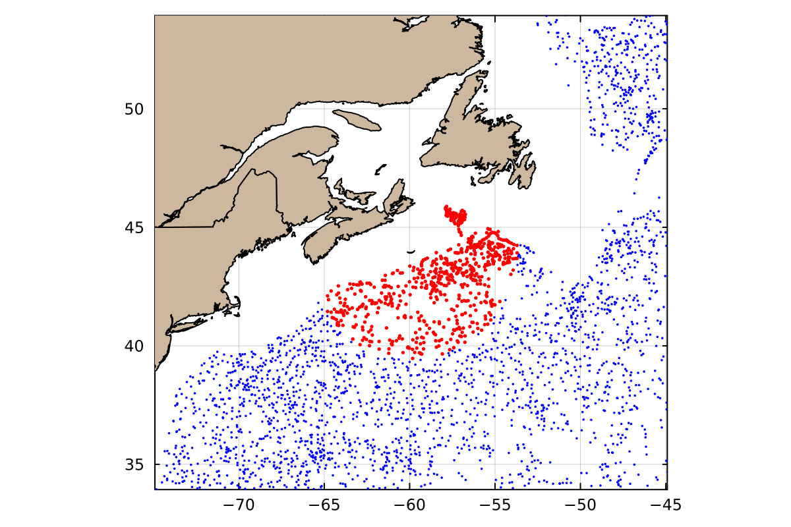
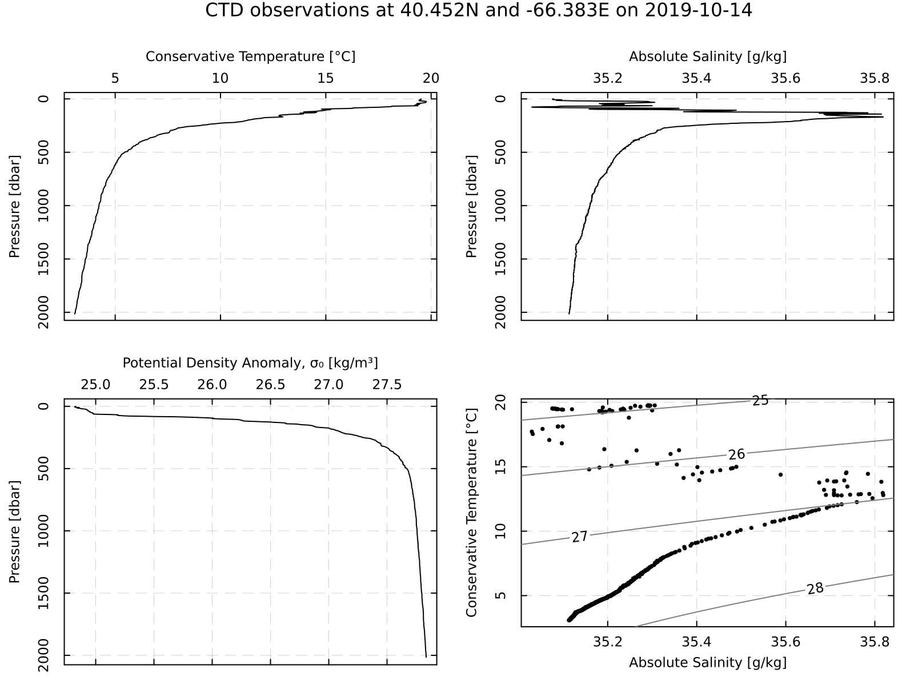

# Examples

## CTD profile diagnostic plot

The following shows how to read a built-in CTD file, and plot some hydrographic
diagrams.

```julia
# %% Read a built-in CTD file
using OceanAnalysis, Plots, Measures
filename = joinpath(dirname(dirname(pathof(OceanAnalysis))),
    "data", "ctd.cnv")
ctd = read_ctd_cnv(filename)
# %% Plot some diagrams that are often useful in analysis
p1 = plot_profile(ctd, "CT")
p2 = plot_profile(ctd, "SA")
p3 = plot_profile(ctd, "sigma0")
p4 = plot_TS(ctd)
plot(p1, p2, p3, p4, layout=(2, 2), size=(800, 800), margin=0.25cm,
    dpi=200)
savefig("ctd_diagram.png")
```



## Argo subset and map

The following shows how to map Argo profile locations made within 500 km
of Sable Island, within the past 365 days.

```julia
# %% Get the index
using OceanAnalysis, CSV, Dates, DataFrames, Plots
index_file = get_argo_index("~/data/argo")
index = read_argo_index(index_file) # 3.2e6 profiles
# %% Select profiles made within the past 365 days
today = now(UTC)
start = today - Dates.Year(1)
index_recent = index[start.<index.time.<today, :] # 1.7e4 profiles
# %% Isolate profiles made within 500 km of Sable Island
SI_lon = -59.9149
SI_lat = 43.9337
distance = map(i -> geod_distance(SI_lon, SI_lat,
        index_recent.longitude[i], index_recent.latitude[i]),
    1:nrow(index_recent))
index_near = index_recent[distance.<500, :]
# %% Plot results on a ap
scatter(index_recent.longitude, index_recent.latitude,
    xlims=SI_lon .+ (-15, 15),
    ylims=SI_lat .+ (-10, 10),
    aspect_ratio=1.0 / cos(SI_lat * pi / 180.0),
    markersize=1, markerstrokecolor=:blue, color=:blue,
    framestyle=:box, dpi=200, legend=false)
scatter!(index_near.longitude, index_near.latitude, markersize=1.5,
    markerstrokecolor=:red, color=:red)
# %% add a coastline for reference
cl_file = joinpath(dirname(dirname(pathof(OceanAnalysis))),
    "data", "coastline_fine.csv.gz")
cl = CSV.read(cl_file, DataFrame, header=1)
plot!(cl.longitude, cl.latitude, seriestype=:shape, color=:bisque3)
savefig("argo_map.png")
```



## Argo profile diagnostic plot

The following shows how to display some useful diagnostic plots for a single
Argo profile.

```julia
# %% Read a built-in Argo file, and plot some hydrographic diagrams
using OceanAnalysis, Plots, Measures
filename = joinpath(dirname(dirname(pathof(OceanAnalysis))), "data",
    "D4902911_095.nc")
ctd = read_argo(filename)
# %% Plot an overview of hydrographic properties
p1 = plot_profile(ctd, "CT")
p2 = plot_profile(ctd, "SA")
p3 = plot_profile(ctd, "sigma0")
p4 = plot_TS(ctd)
plot(p1, p2, p3, p4, layout=(2, 2), size=(800, 800), margin=0.25cm,
    dpi=200)
savefig("argo_profile.png")
```


