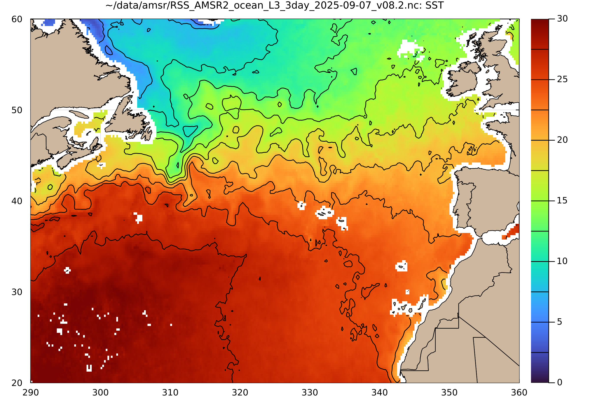
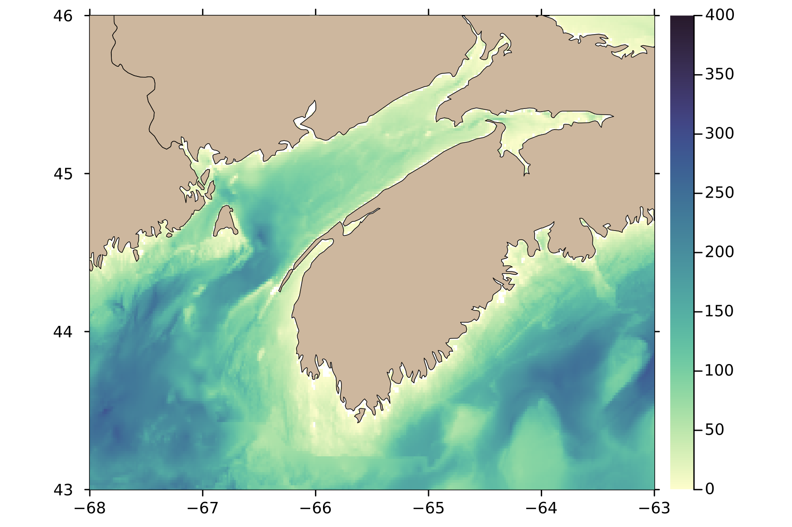

# Examples

## Satellite view of SST

The AMSR satellite provides several data streams, including sea-surface
temperature, which may be plotted as follows.


```julia
# North Atlantic Sea Surface Temperature
using OceanAnalysis, Plots
f = "~/data/amsr/RSS_AMSR2_ocean_L3_3day_2025-09-07_v08.2.nc"
d = read_amsr(f, "SST");
longitude = d.metadata["longitude"];
latitude = d.metadata["latitude"];
SST = d.data;
heatmap(longitude, latitude, SST, framestyle=:box,
    xlims=(290.0, 360.0), ylims=(20.0, 60.0),
    aspect_ratio=1.0 / cos(pi * 40.0 / 180.0),
    color=:turbo, size=(800, 550), dpi=300,
    title=f * ": SST", titlefontsize=9,
    clim=(0, 30))
cl = coastline(:global_fine);
plot!(cl.data.longitude .+ 360, cl.data.latitude,
    seriestype=:shape, color=:bisque3, linewidth=0.8,
    legend=false)
contour!(longitude, latitude, SST, levels=0.0:2.5:40.0, color=:black)
#savefig("amsr.png")
```



## Topography

The following downloads topographic data in the region of the Bay of Fundy,
and plots an image of water depth.

```julia
# Bay of Fundy at approximately 1.6km resolution
using OceanAnalysis, Plots, TiffImages
topo_file = get_topography_file(-68, -63, 43, 46, resolution=1)
topo = read_topography(topo_file);
lon = topo.metadata["longitude"]
lat = topo.metadata["latitude"]
water_depth = -topo.data; # depth is the negative of height
water_depth[water_depth.<0.0] .= NaN; # trim land
heatmap(lon, lat, water_depth,
    xlims=extrema(lon), ylims=extrema(lat),
    aspect_ratio=1.0 / cos(0.5 * (lat[1] + lat[end]) * pi / 180.),
    framestyle=:box, dpi=300,
    tickdirection=:out, color=:deep, clim=(0, 400))
cl = coastline();
plot!(cl.data.longitude, cl.data.latitude,
    seriestype=:shape, color=:bisque3, legend=false, linewidth=0.5)
#savefig("topography.png")
```



## CTD profile diagnostic plot

The following shows how to read a built-in CTD file, and plot some hydrographic
diagrams.

```julia
# %% Read a built-in CTD file
using OceanAnalysis, Plots, Measures, Dates
filename = joinpath(dirname(dirname(pathof(OceanAnalysis))),
    "data", "ctd.cnv")
ctd = read_ctd_cnv(filename)
# %% Plot some diagrams that are often useful in analysis
p1 = plot_profile(ctd, which="CT")
p2 = plot_profile(ctd, which="SA")
p3 = plot_profile(ctd, which="sigma0")
p4 = plot_TS(ctd)
title = "Argo observations at " *
        "$(round(ctd.metadata["latitude"],digits=3))N and " *
        "$(round(ctd.metadata["longitude"],digits=3))E" *
        " on $(Dates.format(ctd.metadata["time"], "yyyy-mm-dd"))"
plot(p1, p2, p3, p4, layout=(2, 2), size=(800, 600), margin=0.25cm,
    dpi=200, plot_title=title, plot_titlefontsize=11)
#savefig("ctd_diagram.png")
```


## Argo subset and map

The following shows how to map Argo profile locations made within 500 km
of Sable Island, within the past 365 days.

```julia
# %% Get the index
using OceanAnalysis, CSV, Dates, DataFrames, Plots
index_file = get_argo_index("~/data/argo")
index = read_argo_index(index_file) # 3.2e6 profiles
# %% Select profiles made within the past 365 days
today = now(UTC)
start = today - Dates.Year(1)
index_recent = index[start.<index.time.<today, :] # 1.7e4 profiles
# %% Isolate profiles made within 500 km of Sable Island
SI_lon = -59.915
SI_lat = 43.934
distance = map(i -> geod_distance(SI_lon, SI_lat,
        index_recent.longitude[i], index_recent.latitude[i]),
    1:nrow(index_recent))
index_near = index_recent[distance.<500, :]
# %% Plot results on a ap
scatter(index_recent.longitude, index_recent.latitude,
    xlims=SI_lon .+ (-15, 15),
    ylims=SI_lat .+ (-10, 10),
    aspect_ratio=1.0 / cos(SI_lat * pi / 180.0),
    markersize=1, markerstrokecolor=:blue, color=:blue,
    tickdirection=:out,
    framestyle=:box, dpi=200, legend=false)
scatter!(index_near.longitude, index_near.latitude, markersize=1.5,
    markerstrokecolor=:red, color=:red)
# %% add a coastline for reference
plot_coastline!(coastline(:global_fine))
#savefig("argo_map.png")
```


## Argo profile diagnostic plot

The following shows how to display some useful diagnostic plots for a single
Argo profile.

```julia
# %% Read a built-in Argo file, and plot some hydrographic diagrams
using OceanAnalysis, Plots, Measures, Dates
filename = joinpath(dirname(dirname(pathof(OceanAnalysis))), "data",
    "D4902911_095.nc")
a = read_argo(filename)
# %% Plot an overview of hydrographic properties
p1 = plot_profile(a, which="CT")
p2 = plot_profile(a, which="SA")
p3 = plot_profile(a, which="sigma0")
p4 = plot_TS(a)
title = "CTD observations at " *
        "$(round(a.metadata["latitude"],digits=3))N and " *
        "$(round(a.metadata["longitude"],digits=3))E" *
        " on $(Dates.format(a.metadata["time"], "yyyy-mm-dd"))"
plot(p1, p2, p3, p4, layout=(2, 2), size=(800, 600), margin=0.25cm,
    dpi=200, plot_title=title, plot_titlefontsize=11)
#savefig("argo_profile.png")
```


